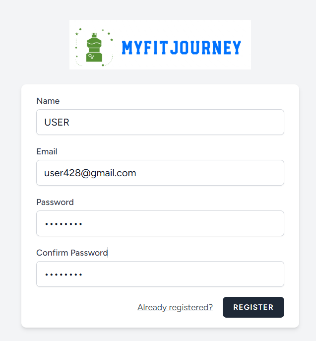
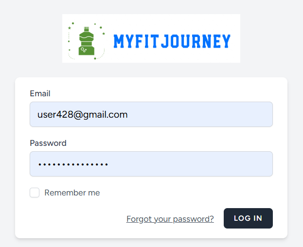
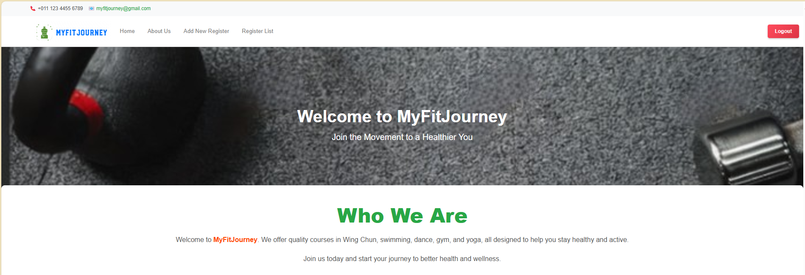
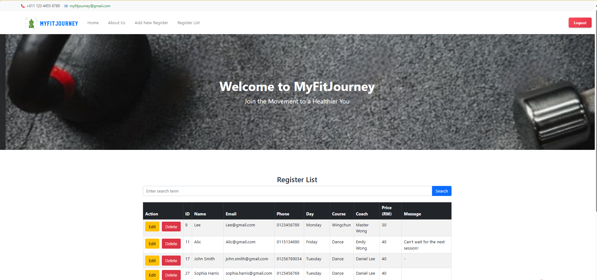
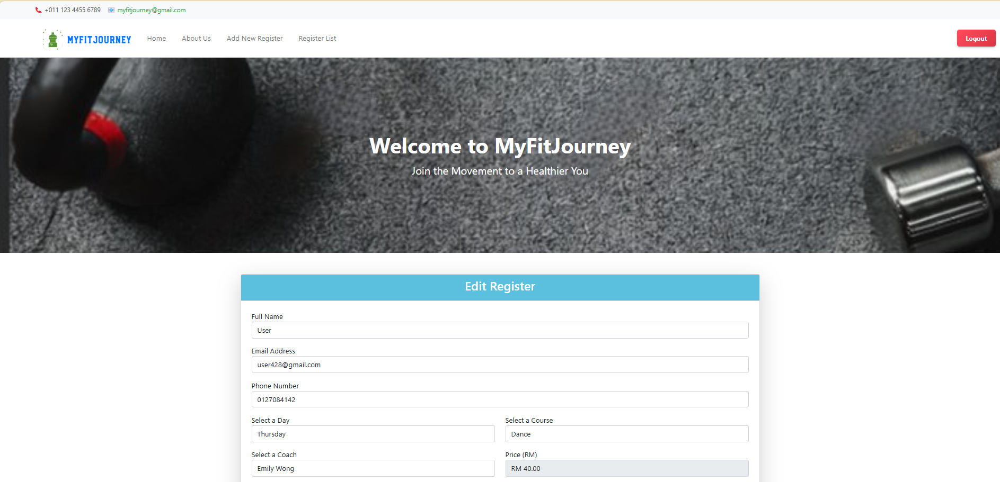
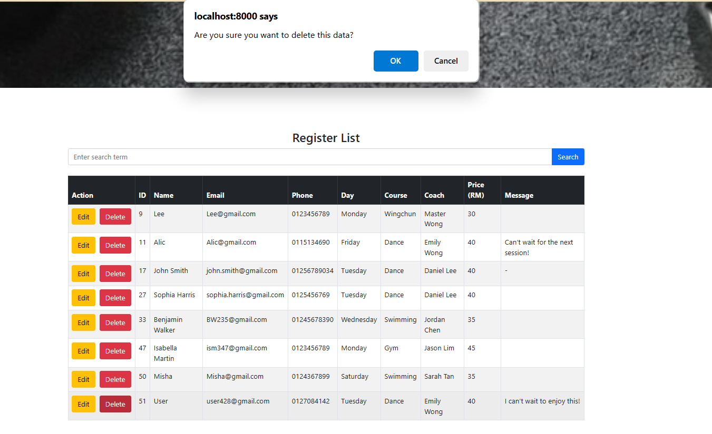
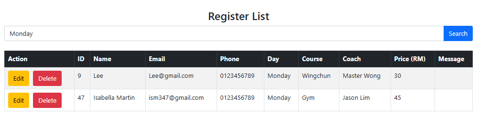

# Health Course Management System

## Project Overview

This project is a web-based **Health Course Management System (HCMS)** developed using the Laravel framework.  
It allows users to enrol in health or gym-related courses online, while administrators can efficiently manage participant records through a centralized system.

The system replaces traditional paper-based registration by providing a more secure, organized, and efficient way to store and manage user data.

---

## Features

### User Features

* User registration and login authentication
* Enrol in health/gym courses
* View course and coach information
* Access course details online

### System Features

* CRUD operations for enrolment records (Create, Read, Update, Delete)
* Search functionality for participant records
* Manage user information (name, email, phone, course, coach, etc.)
* Dynamic form handling
  * Auto-fill price
  * Filter coach based on course
* Data validation and secure storage

---

## Tech Stack

* Frontend: HTML, CSS, JavaScript
* Backend: PHP (Laravel Framework)
* Database: MySQL
* Tools: Laragon, Visual Studio Code

---

## Screenshots

**Figure 1: Register Page**  
This page allows new users to create an account by entering their name, email, and password.

**Figure 2: Login Page**  
Users can log in to the system using their registered email and password.

**Figure 3: Home Page**  
This is the main page of the system where users can access the platform and start course registration.

**Figure 4: About Us Page**  
This page provides information about the health courses and coaches available in the system.

**Figure 5: About Us Page**  
Additional information about courses, coaches, and health training programs.

**Figure 6: Add New Registration**  
Administrators can add new participant records into the system.

**Figure 7: Show Registration**  
This page displays all participant records in a table format.

**Figure 8: Edit Registration**  
This function allows users to update participant information.

**Figure 9: Delete Registration**  
Users can remove unnecessary records from the system.

**Figure 10: Search Registration**  
This feature allows users to search for specific participant records quickly.

---

## Demo Video

Watch the system demonstration here:  
https://youtu.be/JpjyjnpYysg?si=vNH0w3cjTDONJOgY

---

## Source Code

The full source code is available in this repository.

---

## Author

Developed as part of a Web Development course project.

Chong Yu Shuang
